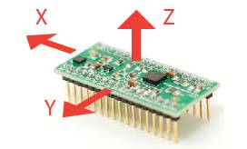

# IMU-study

本项目是“瞰百易”计划的一部分



对常见IMU芯片的原理、驱动和数据融合算法整理，以区分某度、某坛上面碎片化严重到影响入坑的乱象

目录树形图：

```
├─0 加速度计、陀螺仪介绍
├─1 IMU的惯导、数据融合文档
│  ├─卡尔曼介绍
│  ├─四元数-欧拉角
│  └─数据融合、姿态解算
│      └─一种数据融合，算量有点大，没看懂
├─2 MPU系列传感器资料
│  ├─MPU-6050中文资料、测试程序和硬件资料
│  │  ├─MPU-6050官网资料
│  │  ├─原理图
│  │  └─测试程序
│  ├─MPU-6500官网资料
│  ├─MPU-9250官网资料、测试程序和硬件资料
│  │  ├─原理图
│  │  └─测试代码
│  ├─MPU-9255官网资料
│  └─MPU_DMP官网库和说明
│      ├─motion_driver-5.1.3
│      └─motion_driver_6.12
├─3 其他各种IMU
│  ├─ADXL345
│  ├─ENC03
│  ├─L3G4200
│  ├─MMA7455
│  └─MMA8451
└─README.assets
```

